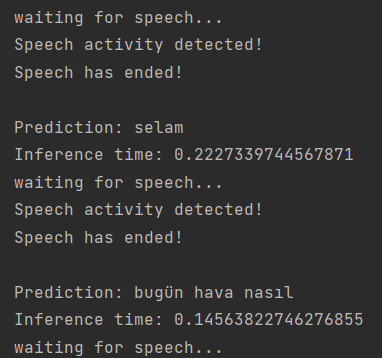

# Real-time-ASR

In this repository we will see how easy it can be exported to an ONNX ASR MODEL in order to run it in an inference with ONNXRuntime.
You can look at [ASR with NeMo](https://github.com/NVIDIA/NeMo/blob/main/tutorials/asr/ASR_with_NeMo.ipynb) for model training, fine-tuning, and deployment.

- ##### Contrary to the Nemo tutorial, we will perform real-time QuartzNet ASR processing audio signals without saving audio for speed-up inference. :tada:

1. First of all, you have to create your asr model. You can look at these links for any language.
- [Turkish-Speech-to-Text](https://github.com/Rumeysakeskin/Turkish-Speech-to-Text)
- [ASR with NeMo](https://github.com/NVIDIA/NeMo/blob/main/tutorials/asr/ASR_with_NeMo.ipynb)

2. I utilized from [Silero VAD](https://github.com/snakers4/silero-vad) pre-trained model for real-time speech detection. If the model detects speech, it starts taking audio frames until the speech stops. Then we will use these audio bytes to make prediction with the ASR model.

3. Run the following command:
```python
python real-time-asr.py
```

